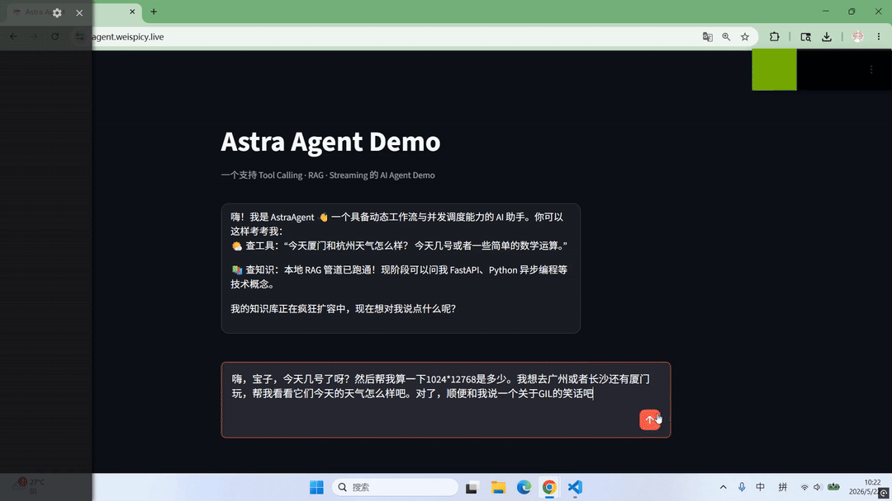

# Astra Agent

## 项目简介
AstraAgent 是一个基于 FastAPI 的轻量级 AI 应用项目，
用于实践动态工作流（Agent Workflow）、RAG 检索增强和工具调用能力。

## 为什么做这个项目
希望通过一个可运行的小型 AI 应用项目，
把自己在 Agent 工作流、RAG 和工具调用上的理解落地实现。

项目主要涉及：

- Tool Calling
- RAG
- 多轮对话
- 简单的动态工作流

## 技术栈

- FastAPI
- OpenAI Compatible LLM API
- FAISS
- Streamlit
- Python 3.11

## Demo


## 功能特性

- [X] 简单的动态 Agent 工作流
- [X] 多轮对话管理
- [X] 基于 LLM 的意图识别
- [X] 自定义工具调用（calc / now / weather）
- [X] RAG 知识问答（FAISS + FastEmbed）
- [X] SSE 流式响应
- [X] 文档上传与向量库持久化
- [X] REST API（FastAPI）

#### Weather 工具（可选）

项目支持基于和风天气 API 的 weather 工具。

由于和风天气采用 Ed25519 JWT 鉴权方式，
如需启用 weather 工具，请自行配置：

- ed25519-private.pem
- ed25519-public.pem

并在和风天气控制台绑定对应公钥。

未配置时，weather 工具会自动降级为不可用状态。

## 项目结构

```text
astra_agent/
├── app/                          # 核心应用代码
│   ├── main.py                   # FastAPI 应用入口
│   ├── config.py                 # 全局配置
│   ├── dev.sh                    # 本地开发脚本
│   ├── start.sh                  # 服务启动脚本
│   │
│   ├── routers/                  # API 路由层
│   │   ├── chat.py               # 对话接口（SSE 流式输出）
│   │   ├── rag.py                # RAG 检索接口
│   │   ├── tool.py               # Tool 调用接口
│   │   ├── memory.py             # 对话历史接口
│   │   └── upload.py             # 文件上传接口
│   │
│   ├── agent/                    # Agent 核心工作流
│   │   ├── core.py               # Agent 主调度入口
│   │   ├── planner.py            # 动态 Planner（步骤规划）
│   │   ├── workflow_executor.py  # Workflow 执行器
│   │   ├── intent.py             # 用户意图识别
│   │   ├── memory.py             # 多轮对话记忆管理
│   │   └── tools/                # 内置工具模块
│   │
│   ├── llm/                      # LLM 调用封装
│   │   ├── llm_client.py         # 普通 LLM 调用
│   │   ├── stream_llm.py         # 流式输出封装
│   │   └── intent_llm.py         # 意图识别模型
│   │
│   ├── rag/                      # RAG 知识库模块
│   │   ├── rag_pipeline.py       # 检索增强生成主流程
│   │   ├── loader.py             # 文档加载与切分
│   │   ├── vector_store.py       # FAISS 向量库封装
│   │   └── config.py             # RAG 配置项
│   │
│   ├── upload/                   # 文件上传与向量化
│   │   ├── service.py            # 文件解析与向量化服务
│   │   ├── progress.py           # 上传进度管理
│   │   └── task_store.py         # 上传任务状态存储
│   │
│   ├── model/                    # Pydantic 数据模型
│   │   ├── agent.py              # Agent 数据结构
│   │   ├── chat.py               # Chat 请求/响应模型
│   │   ├── rag.py                # RAG 数据模型
│   │   ├── tool.py               # Tool 数据模型
│   │   ├── upload.py             # Upload 数据模型
│   │   └── sse.py                # SSE Event 模型
│   │
│   ├── utils/                    # 通用工具模块
│   │   ├── logger.py             # 日志封装
│   │   └── file_hash.py          # 文件 Hash 工具
│   │
├── tests/                        # 单元测试 (mock LLM)
│   ├── test_agent_core.py
│   ├── test_calc.py
│   ├── test_memory.py
│   ├── test_now.py
│   ├── test_planner.py
│   ├── test_tools.py
│   └── test_workflow_executor.py
│
├── eval/                         #   模型决策质量评估
│   ├── dataset_intent.py
│   ├── dataset_planner.py
│   ├── run_intent_eval.py
│   └── run_planner_eval.py
│
├── frontend/                     # Streamlit 前端
│   └── streamlit_app.py          # 对话 UI
│
├── data/                         # 知识库数据
│   ├── knowledge/                # RAG 文档目录
│   └── other/
│
├── docs/                         # 项目文档
│   ├── architecture.md           # 系统架构设计
│   └── frontend_demo.gif         # Demo 演示视频
│
├── vector_store/                 # FAISS 向量索引持久化
│   ├── index.faiss
│   └── index.pkl
│
├── models/                       # Embedding 模型缓存
│   └── models--Qdrant--bge-small-zh-v1.5
│
├── keys/                         # Weather Tool 密钥文件
│   ├── ed25519-private.pem
│   └── ed25519-public.pem
│
├── Dockerfile                    # Docker 镜像配置
├── docker-compose.yaml           # Docker Compose 配置
├── deploy.sh                     # 部署脚本
├── start.sh                      # 项目启动脚本
│
├── README.md                     # 项目说明
├── pyproject.toml                # Python 项目配置
├── uv.lock                       # uv 依赖锁文件
└── .env                          # 环境变量配置
```

## 如何运行

### 本地开发

```bash
cp .env.example .env

uv sync

source .venv/bin/activate

# backend
uvicorn app.main:app --reload --reload-dir app

# frontend
streamlit run frontend/streamlit_app.py
```

- FastAPI Docs: `http://localhost:8000/docs`
- Streamlit UI: `http://localhost:8501`

---

### Docker 部署

```bash
docker compose up -d
```

项目已提供：

- `Dockerfile`
- `docker-compose.yaml`
- `deploy.sh`